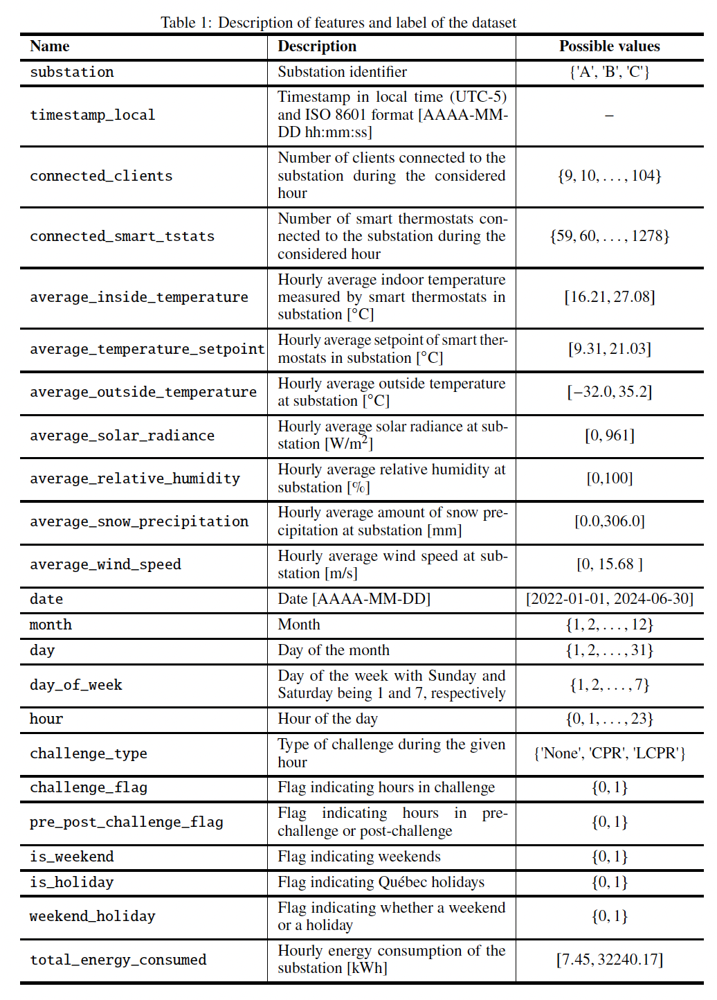

# lcpr-data
Open dataset showcasing 2.5 years of critical peak rebates demand response in a Northern climate (Montreal).

**This dataset is the property of Hydro-Québec and is under license CC BY-NC 4.0 which which forbids any commercial use.**

The dataset is also available from this url: https://donnees.hydroquebec.com/explore/dataset/consommation-clients-evenements-pointe/information/

---

## Description:
In this work, we address the lack of open-source datasets showcasing CPR demand response mechanisms in northern climates by releasing two years of aggregated consumption data for customers participating in an LCPR program in Montréal, Québec, Canada. These customers are spread in three adjacent distribution substations. With it, we hope to stimulate research on trustworthy ML models for demand response applications.

Québec's CPR and LCPR programs have been carried out under the banner of Hilo, a division of Hydro-Québec in charge of DR aggregation. Hilo, calls a DR *challenge* a day ahead of the event, and users choose their degree of participation for the next day. Hilo subscribers are equipped with smart thermostats and their respective heating setpoints are controlled by Hilo, according to an agreed-upon strategy, throughout the event. With the Hilo mobile application and different connected objects, customers can program the response of their house to different *scenes*. For example, they can choose the heating setpoint of each thermostat when there is a DR event, or when nobody is home. When notified, smart thermostats pre-heat the house to augment user comfort during events which typically last 4 hours: either between 6 AM and 10 AM or 5 PM and 9 PM. A maximum of 30 CPR events can be called per year. LCPR is an additional program currently under testing. Testers can be asked for up to 10 extra LCPR events. Rewards are proportional to the total amount of energy shaved during the event, i.e., heating-related curtailment and others, with respect to their estimated baselines

The dataset we share contains the aggregated hourly consumption of 197 anonymous LCPR testers located in three substations. Additional hourly weather data and LCPR information are also present. Table \ref{tab:features} details the features and the label. Note that we also provide cyclical encoding of temporal features, e.g., month, day of the week, and hour. We remark that outliers and anomalies are present in the dataset because of metering and telemetry issues or even blackouts, e.g., an aberrant (and impossible) 32.2 MWh energy consumption is registered at some point.

The features are:


Dataset analyses and benchmarks are provided in our paper.

## Download:
To access the dataset, clone this repository and unzip the files. We provide a French version as well as an English version.

## Cite this dataset and read our paper:
Sliced-Wasserstein-based Anomaly Detection and Open Dataset for Localized Critical Peak Rebates.
```
@article{pallage2024sliced,
  title={Sliced-Wasserstein-based Anomaly Detection and Open Dataset for Localized Critical Peak Rebates},
  author={Pallage, Julien and Scherrer, Bertrand and Naccache, Salma and B{\'e}langer, Christophe and Lesage-Landry, Antoine},
  journal={arXiv preprint arXiv:2410.21712},
  year={2024}
}
```
